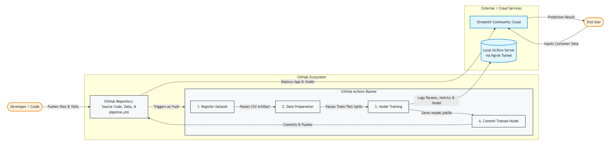
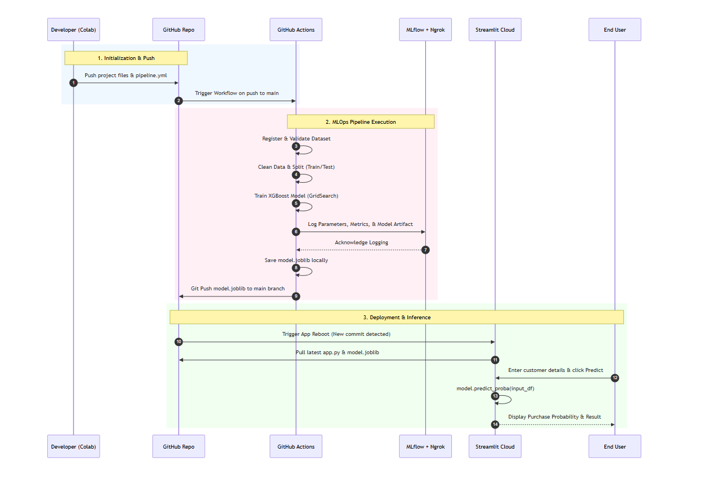

# Tourism Package Prediction MLOps

This repository contains a machine learning pipeline for predicting whether a customer is likely to purchase a wellness tourism package. The project includes dataset registration, preprocessing, train/test split generation, model training, MLflow tracking, and a Streamlit deployment app.

## Project Structure

- `tourism_project/data/` – source dataset (`tourism.csv`)
- `tourism_project/model_building/` – data registration, preprocessing, and training scripts
- `tourism_project/deployment/` – Streamlit app and final trained model
- `.github/workflows/pipeline.yml` – GitHub Actions workflow for CI/CD automation

## Workflow

1. Register the dataset
2. Prepare train/test splits
3. Train the XGBoost model with GridSearchCV
4. Log results to MLflow
5. Save the best model as `tourism_project/deployment/model.joblib`
6. Run the prediction app with Streamlit

## Setup

### 1) Create and activate a virtual environment

```bash
python -m venv venv
# Windows
venv\Scripts\activate
# Linux/macOS
source venv/bin/activate
```

### 2) Install dependencies

```bash
pip install -r tourism_project/requirements.txt
```

### 3) Run the preprocessing pipeline

```bash
python tourism_project/model_building/data_register.py
python tourism_project/model_building/prep.py
```

### 4) Train the model

```bash
python tourism_project/model_building/train.py
```

This script reads:
- `Xtrain.csv`
- `Xtest.csv`
- `ytrain.csv`
- `ytest.csv`

and saves the model to:

```bash
tourism_project/deployment/model.joblib
```

### 5) Launch the Streamlit app

```bash
streamlit run tourism_project/deployment/app.py
```

## MLflow Configuration

The training script uses environment variables for MLflow tracking:

- `MLFLOW_TRACKING_URI`
- `MLFLOW_EXPERIMENT_NAME`

If these are not provided, it falls back to:

- `http://127.0.0.1:5000`
- `tourism_wellness_package`

## Tech Stack

- Python
- Pandas
- NumPy
- scikit-learn
- XGBoost
- MLflow
- Streamlit
- GitHub Actions

## Useful Links

- Google Colab: https://colab.research.google.com/
- Streamlit: https://streamlit.io/
- ngrok: https://ngrok.com/
- MLflow: https://mlflow.org/
- Live App: https://tourism-package-prediction-mlops-mt2dvmefhtfcw3xvuhtswv.streamlit.app/

### High-Level Architecture Diagram (Flowchart)



### Sequence Diagram (Step-by-Step Flow)



## Test Evidences

Project validation screenshots, logs, and output notes can be stored in the `test_evidences/` folder.

## Notes

- The model file is generated during training and should exist in the deployment folder before running the web app.
- The GitHub Actions workflow automates the training pipeline and commits the trained model back to the repository.

## License

This project is intended for educational and demonstration purposes.
